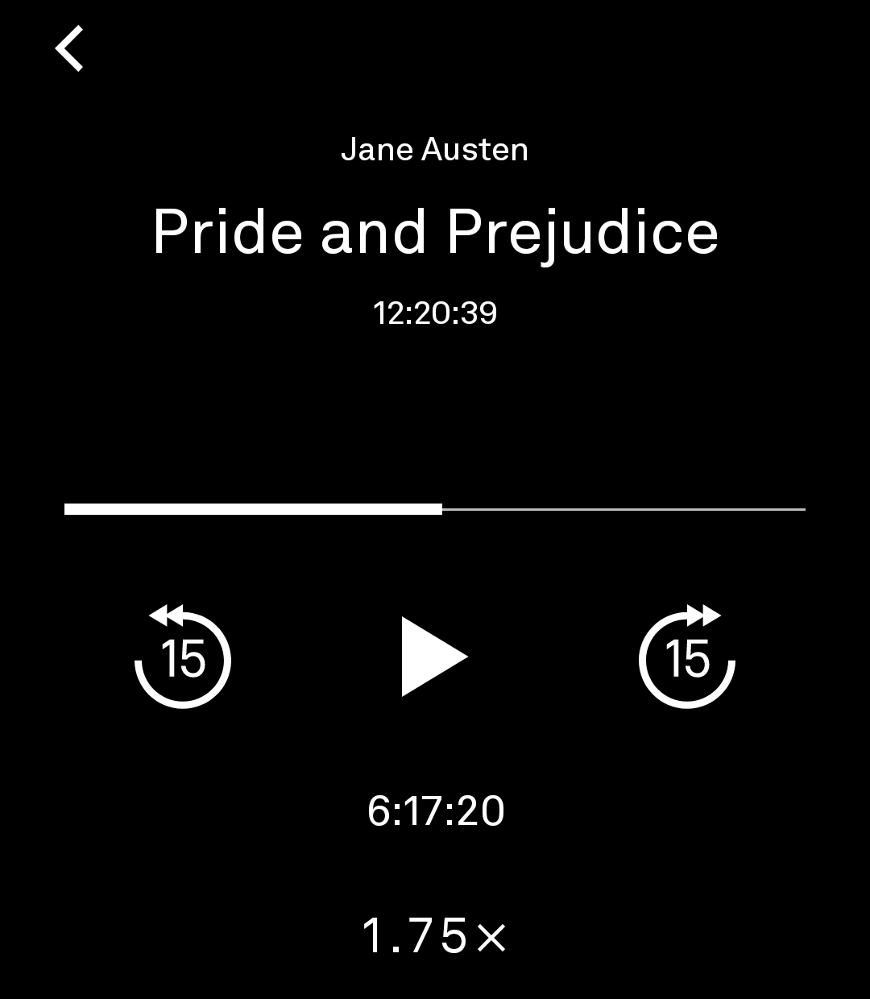
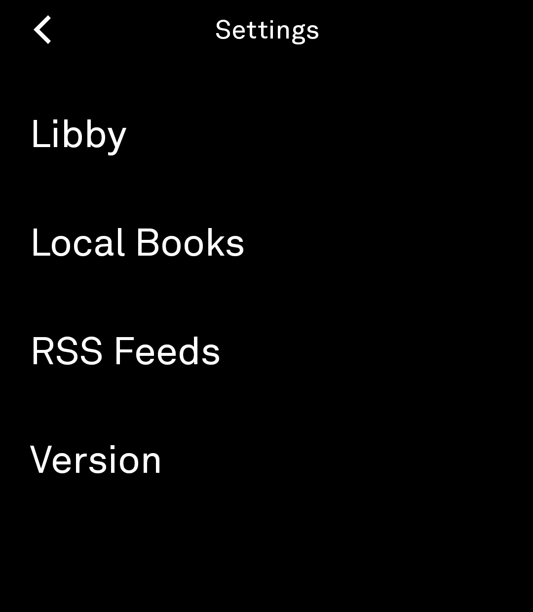
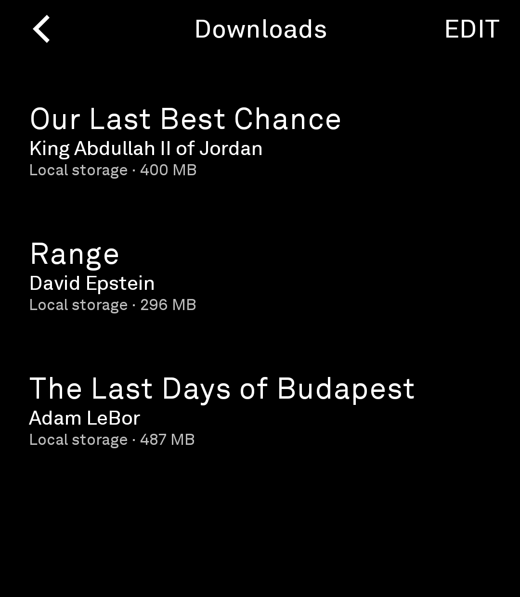

# Bard

*A minimalist audiobook player for the Light Phone III.*

Bard is an audiobook player built specifically for the Light Phone III. It brings local audiobooks, public library loans, and optional RSS audiobook feeds into one calm, text-first interface inspired by the philosophy of Light OS.

Instead of treating audiobooks as another streaming platform, Bard treats them as books. Every supported source appears together in one unified library with one consistent player, allowing you to focus on listening instead of navigating storefronts, recommendations, or media feeds.

There are no recommendations, storefronts, advertisements, social features, or cover art—just your books.

Bard is currently in **alpha**. While it is already suitable for daily use, features and behavior may continue to evolve before a stable release.

> **Current Status:** Alpha
>
> **Current Version:** 0.1.0-alpha3 (versionCode 3)

---

## Screenshots

<table>
  <tr>
    <td align="center"><br><strong>Books</strong></td>
    <td align="center"><br><strong>Player</strong></td>
  </tr>
  <tr>
    <td align="center"><br><strong>Settings</strong></td>
    <td align="center"><br><strong>Downloads</strong></td>
  </tr>
</table>

Regardless of source, every audiobook appears in the same library and uses the same player interface, providing a consistent listening experience throughout the application.

---

# Features

## Local Audiobooks

Bard supports locally stored audiobooks without requiring a cloud account or subscription.

### Supported Formats

- MP3
- M4B

### Features

- Manual library scanning
- Resume playback
- Persistent listening progress
- Recent-first library ordering
- Unified player interface
- Background playback

Local scanning is intentionally limited to the top level of the shared `Audiobooks` folder. Bard does not scan subfolders or copy books into app-private storage.

---

## Public Library Loans

Bard can optionally connect to your public library audiobook loans so borrowed books appear alongside your local library.

Public library loans use the same player interface and controls as every other audiobook source.

Current releases use Libby's **Copy to Another Device** connection process to authorize eligible library loans.

Bard maintains an application-scoped browser session for an authorized library account and uses the provider's official playback system. Bard does not extract protected media files, download library content outside the provider's playback system, bypass DRM or access controls, or replace the provider's playback engine.

Support for public library loans depends on the availability and structure of the provider's web application and may require updates if that service changes.

---

## RSS Audiobooks

Bard also supports standard RSS audiobook feeds.

Each RSS item is treated as an individual audiobook and appears alongside every other supported source.

RSS Audiobooks use the same player interface and controls as every other audiobook source.

Downloads are always initiated by the user.

Removing a downloaded audiobook deletes only Bard's private offline copy while preserving listening progress and feed metadata.

---

# Getting Started

## Local Audiobooks

1. Connect your Light Phone III to your computer.
2. Create an `Audiobooks` folder in shared device storage if it does not already exist.
3. Copy single-file `.mp3` or `.m4b` audiobooks into that folder.
4. In Bard, open:

```
Settings → Local Books → Scan for Books
```

Android may request permission to read your audio library. Bard does **not** request broad "All Files" storage access.

---

## Public Library Loans

1. Open:

```
Settings → Libby → Connect
```

2. On another device already signed into your Libby account, choose **Copy to Another Device**.

3. Enter the setup code displayed by Bard.

Once the authorized session has been established, Bard automatically returns to the Books screen.

Disconnecting clears only Bard's local session and does not disconnect your other authorized devices.

---

## RSS Audiobooks

1. Open:

```
Settings → RSS Feeds → Add Feed
```

2. Enter an HTTP or HTTPS RSS feed URL.

3. Stream immediately or download individual audiobooks for offline listening.

Private RSS feed URLs are stored only in Bard's private application storage. Username/password authenticated feeds are not currently supported.

# Current Limitations

Bard is currently designed for the Light Phone III and Android 13 or newer.

Current limitations include:

- Local audiobooks must be single MP3 or M4B files (multi-file books are not yet supported).
- Chapter navigation is not currently available.
- Cover art is intentionally omitted throughout the interface.
- RSS feeds support one audio enclosure per item.
- Authenticated RSS feeds are not supported.
- RSS feeds do not refresh automatically and never download content without user action.
- Public library setup currently requires another authorized device during initial connection.
- Public library integration depends on the provider's web application and may require updates if that service changes.
- Ebook reading, cloud synchronization, metadata editing, and podcast-specific features are not currently supported.

---

# Architecture

Bard is a native Android application written in Kotlin using Jetpack Compose.

Its architecture is intentionally simple, with separate components responsible for library management, playback, RSS feeds, local audiobook discovery, and persistent user data.

Regardless of source, every audiobook is presented through the same unified library and player interface, providing a consistent listening experience throughout the application.

Bard incorporates selected user-interface resources derived from the Light SDK.

---

# Development

## Requirements

- JDK 17
- Android Studio
- Android SDK (API 36)

## Build

```bash
./gradlew assembleDebug
```

Release signing instructions are available in `RELEASE.md`.

---

# Privacy & Security

Bard does not include analytics, advertising, telemetry, or user accounts.

Local audiobooks remain on your device, and RSS downloads are stored only in Bard's private application storage.

When using public library loans, authentication and media delivery continue to be handled by the provider's own systems.

Release builds disable WebView debugging.

---

# Roadmap

Planned improvements include:

- Multi-file audiobook support
- Chapter navigation
- Improved Bluetooth controls
- Expanded RSS capabilities
- Additional playback refinements
- Improved download management
- Additional audiobook sources
- Performance and stability improvements

---

# Contributing

Contributions, bug reports, feature requests, and suggestions are welcome.

If you encounter a bug, please include:

- Bard version
- Light Phone III software version
- Steps to reproduce
- Expected behavior
- Actual behavior

Before opening an issue, please check whether the problem has already been reported.

---

# Frequently Asked Questions

### Does Bard require an account?

No.

Local audiobooks work entirely offline and do not require an account.

Public library loans require an account with a supported library lending service. RSS feeds do not require a Bard account.

---

### Does Bard collect analytics or usage data?

No.

Bard does not include analytics, advertising, telemetry, or user tracking.

---

### Does Bard support offline listening?

Yes.

Local audiobooks are always available offline. RSS audiobooks may be downloaded for offline playback. Public library loans are streamed only to respect library licensing and content restrictions.

---

# Important

Bard is an independent, unofficial open-source project.

Bard is not affiliated with, endorsed by, sponsored by, or approved by The Light Phone, Inc., OverDrive, Inc., or any public library system.

Bard's optional public library integration requires the user's own authorized library account and uses the provider's official authentication and playback systems. Bard does not provide access to books that have not been legitimately borrowed.

Bard does not redistribute third-party applications, audiobook content, DRM-protected media, or user credentials.

Compatibility with third-party services is not guaranteed and may change over time as those services evolve.

Users are responsible for ensuring that their use of Bard complies with the terms governing any third-party services they choose to access.

Libby and OverDrive are trademarks of OverDrive, Inc.

Light Phone and Light OS are trademarks of The Light Phone, Inc.

Other trademarks are the property of their respective owners and are used solely to identify compatibility with third-party products and services.

---

# License

Bard is licensed under the MIT License.

See [LICENSE](LICENSE) for the complete license text.

Bard incorporates selected resources derived from the Light SDK. Applicable notices are included in [THIRD_PARTY_NOTICES.md](THIRD_PARTY_NOTICES.md).

---

Built with ❤️ for the Light Phone community.
